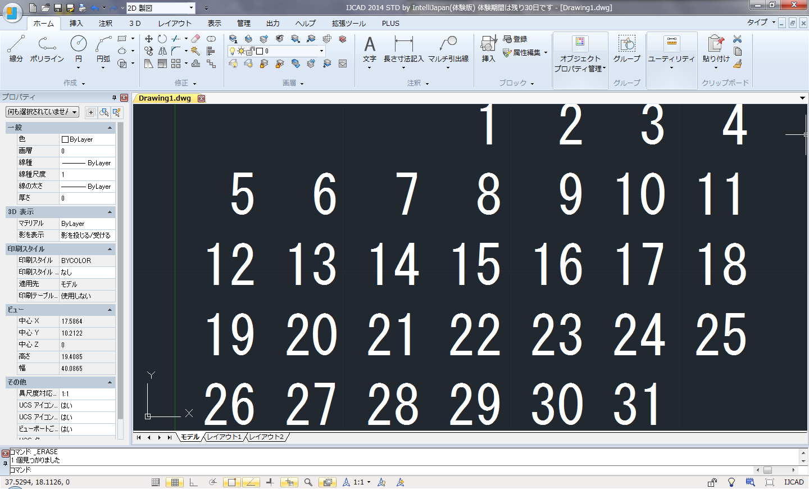

Calender.vbi
====

## これは何

[プロ生ちゃん #カレンダープログラミング プチコンテスト 2014](http://pronama.azurewebsites.net/2014/10/12/calendar-programming-contest/)への参加のために作成したカレンダー出力VBAです。  
AutoCAD互換のIJCAD 2014 Stdで作成しました。多分AutoCADでも動くと思います。

## 使い方

どこかに「マクロ実行」的なアイコンがあると思うのでそこから`Calendar`を実行するとドローイングエリアに文字列としてカレンダーが作図されます。  

----
2014-10-21 Zoar.